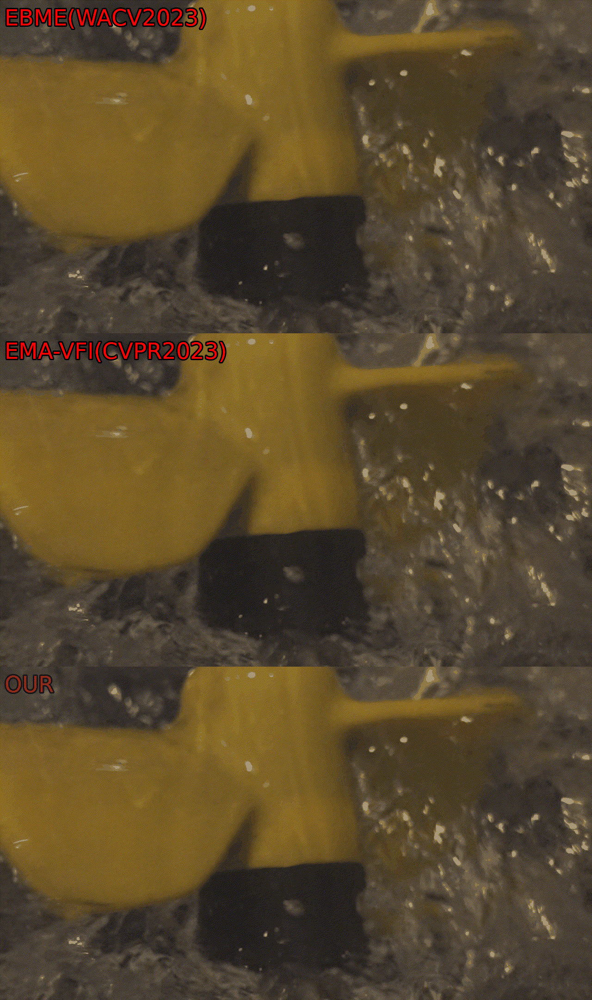
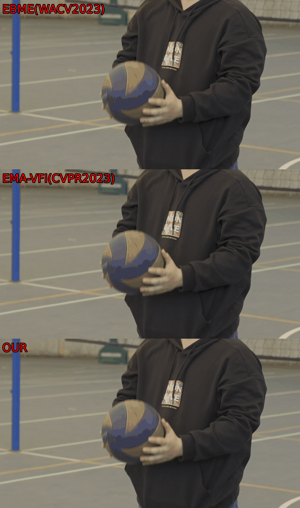
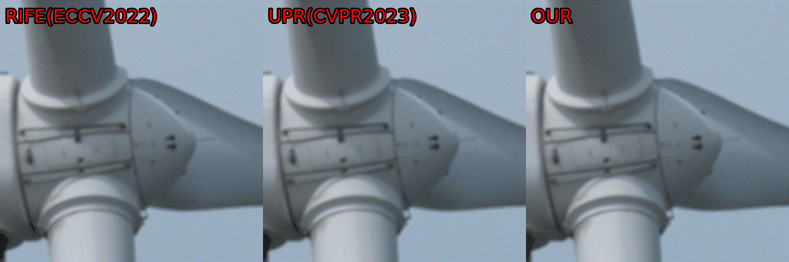
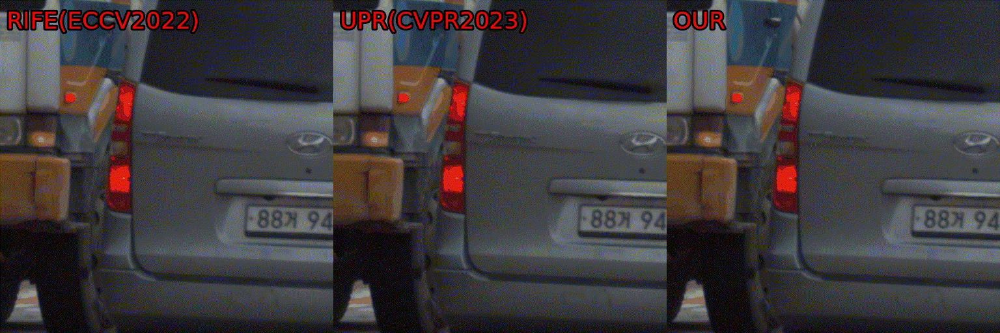

# Video Frame Interpolation for Extreme Motion Scenes Based on Dual Alignment and Region-Adaptive Interaction 


## 💻 Code

We release the core implementation of our video frame interpolation model, alongside qualitative results and the UHD4K120FPS-N dataset. The source code is available in [here](https://github.com/nxkobe/ExtremeMotion-VFI/tree/main/model). 

## 📁 UHD4K120FPS-N Dataset

We currently release a subset of the training data and the complete test set of UHD4K120FPS-N; the full training set will be made publicly available in a subsequent version. Download `UHD4K120FPS-N dataset` in [Baidu Netdisk](https://pan.baidu.com/s/1-_mC0amK3ijZB_8U1PFplg?pwd=923b) or [Google Drive](https://drive.google.com/drive/folders/1KvewbnfT9W_3x6x53_fq4Ldv5el_vjGS?usp=drive_link).


## 🎬 Visual Results & Demo

🎯 Examples of the VFI (**x2 Interpolation**) results on `UHD-N-Test`:

<p align="center">
  
  
</p>
-------------------------------------------------------------------------


🚀 Examples of the VFI (**x8 Interpolation**) results on `X-Test`:

<p align="center">
  <br>
   <br>
    <br>
  
</p>


For more experimental results, please refer to our paper.


## 	Citation

```
@inproceedings{
  title={Video Frame Interpolation for Extreme Motion Scenes Based on Dual Alignment and Region-Adaptive Interaction },
  year={2025}
}
```

